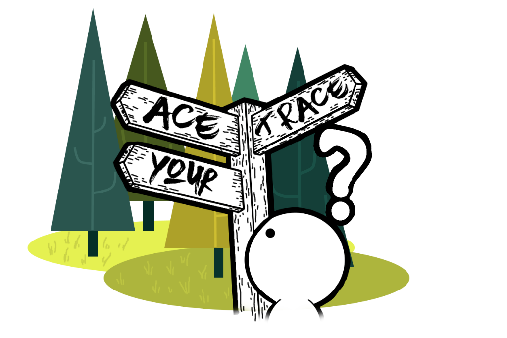

<!-- PROJECT LOGO -->
 

    
    <h3 align="center">Ace Your Trace</h3>
    

        An interactive web application to generate personalized walking routes during the COVID-19 pandemic.
         
        <a href="https://github.com/Niks-Kozlovs/AceYourTrace/tree/master">View original</a>
        ·
        <a href="https://github.com/Niks-Kozlovs/AceYourTrace/issues">Report Bug</a>
        ·
        <a href="https://github.com/Niks-Kozlovs/AceYourTrace/issues">Request Feature</a>
    

<!-- TABLE OF CONTENTS -->

    
Table of Contents

    <ol>
        <li><a href="#about-the-project">About The Project</a></li>
        <li><a href="#features">Features</a></li>
        <li><a href="#principles-and-best-practices">Principles and Best Practices</a></li>
        <li><a href="#built-with">Built With</a></li>
        <li>
            <a href="#getting-started">Getting Started</a>
            <ul>
                <li><a href="#prerequisites">Prerequisites</a></li>
                <li><a href="#installation">Installation</a></li>
            </ul>
        </li>
        <li><a href="#usage">Usage</a></li>
        <li><a href="#license">License</a></li>
        <li><a href="#contact">Contact</a></li>
    </ol>

## About The Project
https://github.com/user-attachments/assets/ff25b70e-e6ea-401d-9c13-d7c367ec3df1

"Ace Your Trace" is an interactive web application developed during a weekend hackathon, aimed at providing users with personalized walking routes during the COVID-19 pandemic. With many places closed and people confined to limited areas, this app helps users explore their surroundings by generating routes based on their desired distance. Users can specify path preferences such as nature trails or beachside walks, as well as choose difficulty levels ranging from easy routes with flat terrain to challenging paths with significant elevation changes.

Due to the hackathon's time constraints, the application focuses on generating routes based on user-defined distance. Users can select their starting point on an interactive map or use their current location, input their desired distance, and receive an optimal route for their walk.

As the lead developer on the team, I was responsible for the core functionality and architecture of the application. Our innovative solution earned third place in the hackathon competition.

## Features

* Route Generation: Generates walking routes based on user-defined distance.
* Interactive Map: Utilizes an interactive map interface for selecting starting points and visualizing routes.
* Geolocation Support: Offers the option to use the user's current location via the Geolocation API.
* Customizable Parameters: Allows users to input desired distances in kilometers or time.
* Route Visualization: Displays generated routes on the map using polylines.
* User Interface Controls: Provides intuitive UI elements for input validation and navigation.
* Real-time Feedback: Updates routes immediately based on user input and map interactions.

## Principles and Best Practices

This project demonstrates several key software development principles and best practices:

* Modular Architecture: The application is organized using ES6 modules, promoting code modularity and reusability.
* Separation of Concerns: Implements distinct classes for different functionalities:
  * Settings for managing user preferences.
  * MapController for handling map interactions.
  * RoutingService for fetching and processing routes.
  * UIController for managing user interface events and updates.
* Modern JavaScript Features: Utilizes ES6+ features like classes, arrow functions, and async/await for cleaner and more efficient code.
* Asynchronous Programming: Employs Promises and async/await to handle asynchronous operations such as fetching routes from APIs.
* Event Handling: Uses event listeners and binding to manage user interactions smoothly.
* Clean Code Practices: Emphasizes readable and maintainable code with proper naming conventions and modular functions.
* Version Control with Git: Maintains code history and collaboration through Git.

## Built With

    
    
    
    
    
    

## Getting Started

To get a local copy up and running, follow these steps.

### Prerequisites

* Modern Web Browser: Chrome, Firefox, Edge, or Safari
* Internet Connection: Required to fetch map tiles and routing data
* API Key for GraphHopper: Needed to use the GraphHopper Routing API

### Installation

1. Clone the Repository
2. Obtain a GraphHopper API Key
    * Sign up at GraphHopper to get a free API key
3. Configure the Application
    * Open `app.js` and replace the placeholder API key with your own
4. Open the Application
    * Open `index.html` in your web browser

## Usage

### Set Distance and Route Type

* Use the sidebar to input your desired distance and select the route type (from A to B or round trip)

### Select Starting Point

* Click on "Use Current Location" to set your location via the Geolocation API
* Alternatively, click on the map to choose a starting point

### Generate Routes

* Click on "Preview Routes" to generate and display routes based on your input

### Interact with the Map

* Pan and zoom to explore the map
* Generated routes are displayed as polylines on the map

## License

This project is released under the Unlicense, allowing for free use and distribution.

## Contact

Niks Kozlovs - [@NiksKozlovs](https://x.com/NiksKozlovs) - kozlovs.niks1@gmail.com
